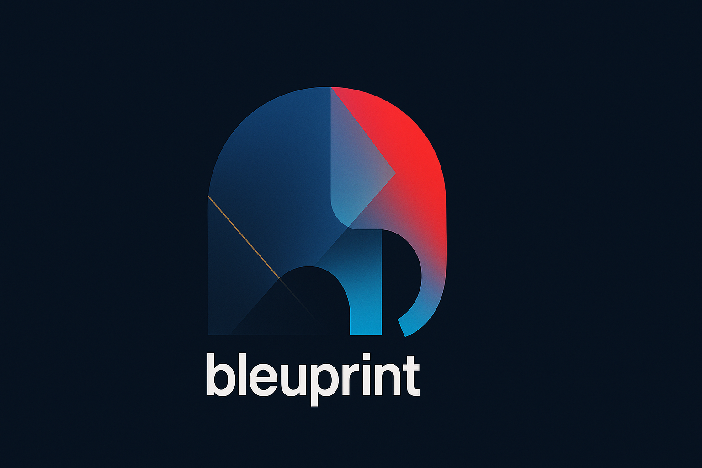

<div align="center">
  
</div>

# Nix-Darwin Mac Setup Template

> 🎯 A **template repository** for bootstrapping a modern, reproducible Mac development environment with 120+ tools using Nix-Darwin.

[](https://github.com/YOUR-USERNAME/YOUR-REPO/generate)

## ✨ Features

- 🚀 **One-command setup** - Bootstrap a new Mac in ~15 minutes
- 🔒 **Security-first design** - Safe for public repos, manual configuration required
- 📦 **120+ modern CLI tools** - Including Rust-based replacements for traditional Unix tools
- 🔄 **Fully reproducible** - Same command = same environment, every time
- ⚡ **Instant rollbacks** - Break something? Roll back in seconds
- 🎛️ **Highly configurable** - Modular design makes customization easy
- 🛡️ **Security-first** - Git hooks prevent sensitive data leaks, Touch ID sudo, encryption tools

## 🚀 Quick Start

### Using This Template

1. Click ["Use this template"](https://github.com/YOUR-USERNAME/YOUR-REPO/generate) button above
2. Clone your new repository
3. Follow the [Setup Guide](./SETUP.md)

### TL;DR for Experienced Users

```bash
# Clone your repo
git clone https://github.com/YOUR-USERNAME/YOUR-REPO.git
cd YOUR-REPO

# 🔒 REQUIRED: Update configuration (for security)
# Option A: Environment file (recommended - keeps sensitive data out of repo)
cp .env.example .env           # Copy template
nano .env                      # Edit with your details
./load-env-config.sh          # Apply configuration

# Option B: Manual configuration
# nano modules/home/default.nix  # Set Git name/email
# nano flake.nix                 # Set hostname/username

# Optional: Interactive configuration wizard
./auto-configure.sh

# Bootstrap your Mac
./bootstrap-mac.sh

# Verify installation
./smoke-test.sh
```

> **⚠️ Security Notice**: This template requires manual configuration of personal details. It will NOT automatically write sensitive information like emails or SSH keys to avoid security risks in public repositories.

## 📁 Repository Structure

```
.
├── flake.nix                    # Main configuration entry point
├── bootstrap-mac.sh             # One-click setup script
├── smoke-test.sh                # Verify installation
├── SETUP.md                     # Detailed setup guide
├── CONFIG_OPTIONS.md            # All configuration options
├── CLI_CHEATSHEET.md           # Quick reference for tools
└── modules/
    ├── system/
    │   ├── core.nix            # Languages, build tools, system settings
    │   ├── cli-utils.nix       # 100+ CLI productivity tools
    │   └── ml-stack.nix        # Optional ML/data science tools
    ├── homebrew/
    │   └── apps.nix            # GUI apps and Mac-specific tools
    └── home/
        ├── default.nix         # User configuration (shell, git, etc.)
        └── aliases.nix         # Configurable modern tool aliases
```

## 📦 What's Included

### Development Core (`modules/system/core.nix`)
- **Languages**: Go 1.24, Rust (via rustup), Python 3.13, Node.js 22 LTS
- **Build Tools**: CMake, Make, Just, Ninja
- **Environment**: direnv, nix-direnv
- **System Settings**: Touch ID sudo, fast key repeat, Nix hardening (fsync)

### CLI Tools (`modules/system/cli-utils.nix`)
- **Modern Replacements**: `eza`/`lsd` (ls), `bat` (cat), `fd` (find), `ripgrep` (grep), `erd` (tree)
- **Productivity**: `fzf`/`sk`, `zoxide`, `tldr`, `atuin`/`mcfly`, `starship`
- **Development**: `gh`, `lazygit`/`gitui`, `delta`, `httpie`/`xh`/`curlie`, `jq`/`yq`
- **System Monitoring**: `btop`/`bottom`, `duf`, `dust`, `procs`, `bandwhich`
- **Text Processing**: `sd`, `gron`, `choose`, `grex`, `hexyl`
- **Security**: `age`, `sops`, `gpg`, `yubikey-manager`
- **Containers**: `act`, `podman`, `dive`
- **Performance**: `hyperfine`, `flamegraph`, `perf`
- **Additional**: `helix`, `zellij`, `broot`, `silicon`, `mdbook`

### GUI Apps (`modules/homebrew/apps.nix`)
- **Essentials**: Raycast, VS Code, OrbStack, Kitty
- **Productivity**: Obsidian, Slack, Notion
- **Dev Tools**: GitHub Desktop, Insomnia, TablePlus
- **Utilities**: Stats, Rectangle, iTerm2, WezTerm
- **Security**: 1Password, 1Password CLI

### Optional: ML/Data Science Stack (`modules/system/ml-stack.nix`)
- **Deep Learning**: PyTorch, TensorFlow (with Metal support)
- **Data Science**: scikit-learn, pandas, numpy, matplotlib
- **Notebooks**: Jupyter, IPython
- **Big Data**: Apache Spark, DuckDB, Polars
- **Visualization**: Plotly

### User Config (`modules/home/default.nix`)
- **Shell**: Zsh with syntax highlighting, autosuggestions
- **Git**: Delta diffs, useful aliases, better defaults
- **Tmux**: Vi mode, better keybindings, mouse support
- **SSH**: Connection multiplexing for speed

## 🔧 Common Commands

```bash
# Apply changes after editing
darwin-rebuild switch --flake ".#testhost"

# Rollback to previous generation
darwin-rebuild rollback

# Update all packages
nix flake update
darwin-rebuild switch --flake ".#testhost"

# Search for packages
nix search nixpkgs <package-name>

# Clean old generations
nix-collect-garbage -d
```

## 📝 Customization

### Enable Modern Tool Replacements
To replace traditional commands with modern alternatives, edit `modules/home/default.nix`:
```nix
# Change from:
programs.modernTools.enable = false;

# To:
programs.modernTools.enable = true;
```

This will set up aliases like:
- `ls` → `eza --icons`
- `cat` → `bat`
- `grep` → `rg`
- `find` → `fd`
- `top` → `btop`
- `df` → `duf`
- `du` → `dust`
- And more...

### Add a CLI tool
Edit `modules/system/cli-utils.nix`:
```nix
environment.systemPackages = with pkgs; [
  # ... existing packages ...
  your-new-tool  # https://link-to-docs.com
];
```

### Add a GUI app
Edit `modules/homebrew/apps.nix`:
```nix
casks = [
  # ... existing casks ...
  "your-app-name"
];
```

### Change shell aliases
Edit `modules/home/default.nix`:
```nix
shellAliases = {
  # ... existing aliases ...
  myalias = "my-command";
};
```

### Enable ML/Data Science Stack
Edit `flake.nix` to add the ML module:
```nix
modules = [
  ./modules/system/core.nix
  ./modules/system/cli-utils.nix
  ./modules/system/ml-stack.nix  # Add this line
  ./modules/homebrew/apps.nix
  # ...
];
```

## 🔗 Quick Links

- [Configuration Options](./CONFIG_OPTIONS.md) - All available settings
- [CLI Cheatsheet](./CLI_CHEATSHEET.md) - Quick command reference
- [Nix-Darwin Documentation](https://github.com/LnL7/nix-darwin)
- [Home Manager Options](https://nix-community.github.io/home-manager/options.html)
- [Nix Package Search](https://search.nixos.org/packages)

## 🤝 Contributing

Contributions are welcome! Please see [CONTRIBUTING.md](./CONTRIBUTING.md) for guidelines.

## 📄 License

This template is available under the MIT License - see [LICENSE](./LICENSE) for details.

## 🙏 Acknowledgments

- [Nix-Darwin](https://github.com/LnL7/nix-darwin) for the excellent macOS Nix integration
- [Home Manager](https://github.com/nix-community/home-manager) for user environment management
- The Nix community for amazing packages and support

## 💡 Pro Tips

- Use `tldr <command>` for quick command examples
- `z <partial-path>` to jump to directories (via zoxide)
- `Ctrl+R` for fuzzy history search (via fzf)
- `lazygit` for visual Git operations
- `btop` for beautiful system monitoring
- Run `./test-modern-tools.sh` to see your current configuration

---

<p align="center">
  Made with ❤️ for the Mac development community<br>
  <a href="https://github.com/YOUR-USERNAME/YOUR-REPO/stargazers">⭐ Star this repo</a> •
  <a href="https://github.com/YOUR-USERNAME/YOUR-REPO/issues">🐛 Report an issue</a> •
  <a href="https://github.com/YOUR-USERNAME/YOUR-REPO/discussions">💬 Discussions</a>
</p> 